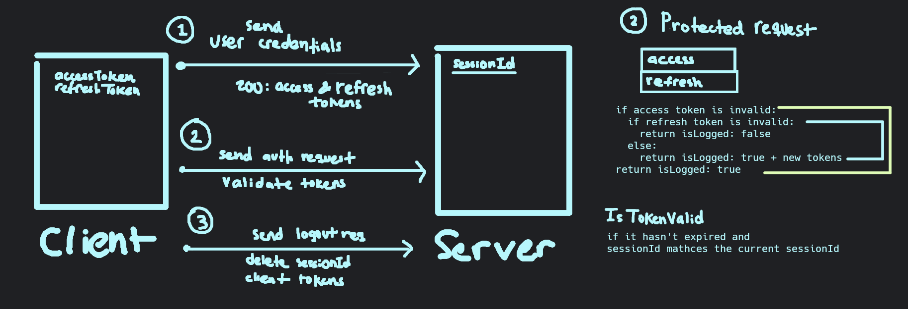

# Auth workflow:

accessToken (expires in 10-15 minutes)

refreshToken (expires in 1-7 days)

## Login/Register:
- client sends user credentials
- server validates credentials
- on valid credentials:
    - sends a cookie with the `sessionId`
    - next time the client sends a request verify the cookie

## On Request:
- client sends cookie or bearer token
- server verifies the cookie/token `sessionId` matches the current sessionId

    ### Simple
    - get the cookie/token payload (`sessionId`) (expires after some hours)
    - verify that the `sessionId` matches payload's `sessionId`
        - ok: respond to the request normally
        - err: respond with auth error

    ### With JWT
    - the accessToken is ok: respond to the request normally
    - the accessToken has expired or doesn't match the current sessionId:
        - refreshToken is ok: send new accessToken and refreshToken with the response
        - refreshToken has expired: stop request, respond with an auth error

## Logout:
- client sends a request to `/logout`
- server clears the cookie, makes a cookie with no payload and low expiration time
- client receives the empty cookie

## Cookie:
- http only cookie, the client can't access it
- client sends the cookie with  `include: credentials` on every request
- server should allow cors for the client domain and accept credentials

## Protecting routes:
- add a middleware to check the cookie payload
- in case the cookie payload to verify the cookie from the client

### Improvements

**Change server?**

Explore the option to use Fastify + Typescript instead of express

